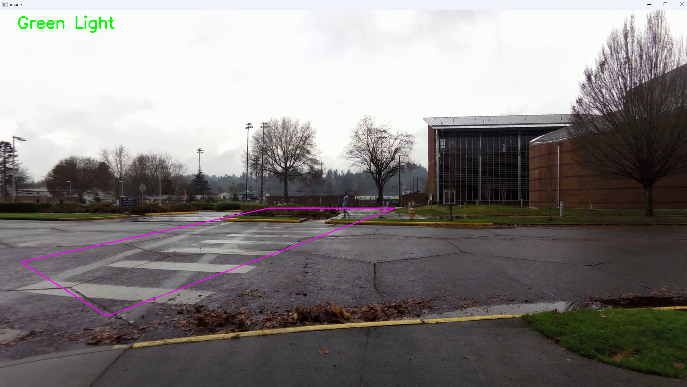
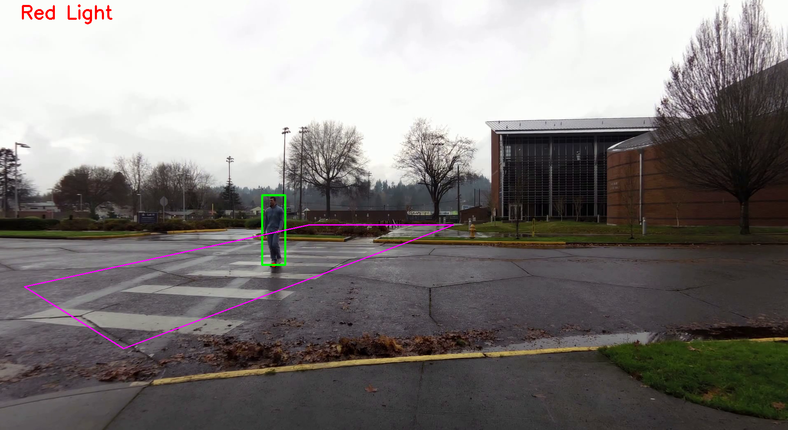

# Tracking People on Crosswalk and Traffic Light System

A real-time Computer Vision application that dynamically controls a virtual traffic light based on pedestrian crosswalk occupancy. Built using deep learning for object detection and geometric mathematics for spatial tracking.

 


## Project Overview
The goal of this project is to create an automated safety system for crosswalks. Using a pre-trained YOLOv8 model, the system tracks pedestrians in real-time. If a person's physical footprint enters a custom-drawn polygonal boundary (the crosswalk), the system instantly triggers a "Red Light" warning for vehicles. Once the crosswalk is completely clear, it returns to a "Green Light" state.

## Features
* **Tracking people on crosswalk:** Utilizes the `YOLOv8n` model and ByteTrack to detect and maintain unique IDs for people in the video frame.
* **Dynamic ROI Occupancy:** Uses OpenCV (`cv2`) to draw a precise 4-point Region of Interest (ROI) polygon over the physical crosswalk.
* **Footprint Collision Math:** Calculates the exact bottom-center coordinate of a pedestrian's bounding box to determine if their feet are physically inside the crosswalk zone, ignoring background movement.
* **Automated Traffic Control:** Live video overlay that switches between **🟢 Green Light** (clear) and **🔴 Red Light** (occupied) based on real-time crowd data.

## Tech Stack
* **Python**
* **Ultralytics YOLOv8** (Deep Learning / Object Detection)
* **OpenCV** (Video processing, geometric drawing, coordinate mapping)
* **NumPy** (Array math for polygon generation)

## How to Run
1. Clone the repository:
```bash
git clone [https://github.com/](https://github.com/)[Your-Username]/[Your-Repository-Name].git
